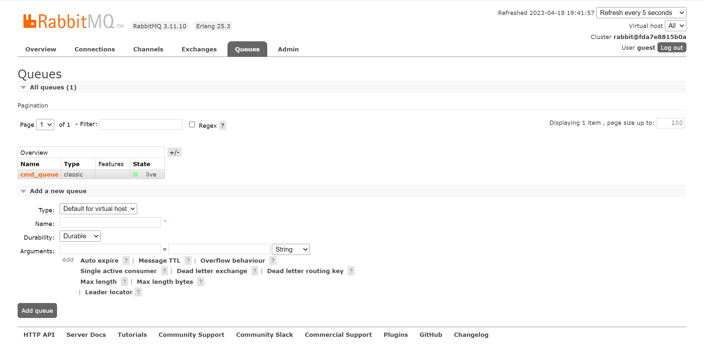
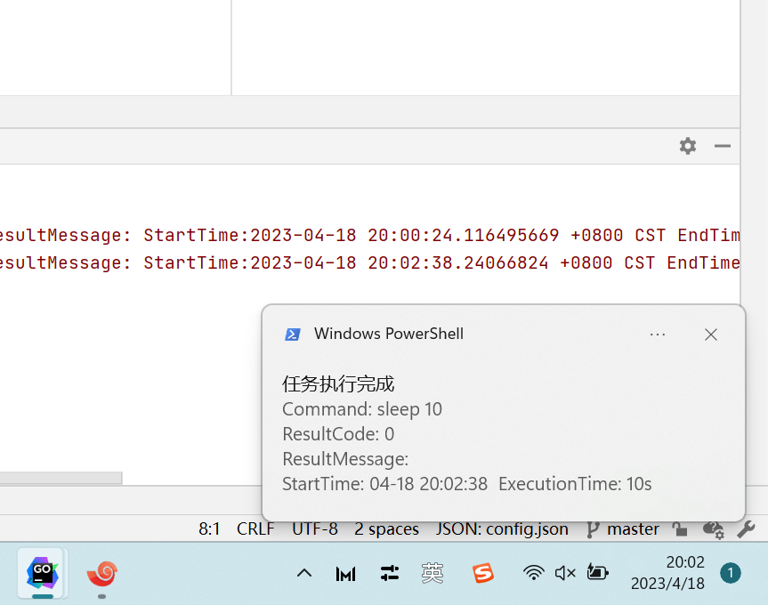

# MsgAlert
Linux Command Line Run Return Reminder Tool

## download
```shell
# clone repository
git clone https://github.com/linlin-coder/MsgAlert.git
```

## install
### server install
MsgAlert depend on RabbitMQ, so much so that you need to install RabbitMQ first, it is recommended to use Docker for installation, as follows:
```shell
docker pull rabbitmq:latest
docker run -d --name rabbitmq -p 5672:5672 -p 15672:15672 rabbitmq:latest
```
You can use PublicIP:15672 to manage your RabbitMQ server online


### windowns client install
Before you use this function, you must be installed golang interpreter, running model as follows:
1. Modify the config.json file in the client directory and fill in the server IP for deploying RabbitMQ in the configuration file, such as 127.0.0.1
```json
{
  "rabbitmq": {
    "serverIP": "127.0.0.1",
    "port": "5672",
    "sender": "zhangsan"
  }
}
```
2. Enter the client directory and run the following command
```shell
go run main.go
```

### cluster client install
Like windowns client install steps, first of all, you should installed golang interpreter and clone this repository in you self directory.  
1. Modify the config.json file in the server directory and fill in the server IP for deploying RabbitMQ in the configuration file, such as 127.0.0.1
```json
{
  "rabbitmq": {
    "serverIP": "127.0.0.1",
    "port": "5672",
    "sender": "zhangsan"
  }
}
```
2. Enter the server directory and run the following command
```shell
# if you want to return running result of "sleep 10"
go run main.go sleep 10
# or like this
nohup go run main.go sleep 10 &
# or like this
nohup go run main.go sleep 10 1>2 2>~/.out.log &
```

## Result example
If you run commands such as sleep 10 in a computing cluster, the Windows notification center displays the following message.
```shell
go run main.go sleep 10
```

Result Return:
